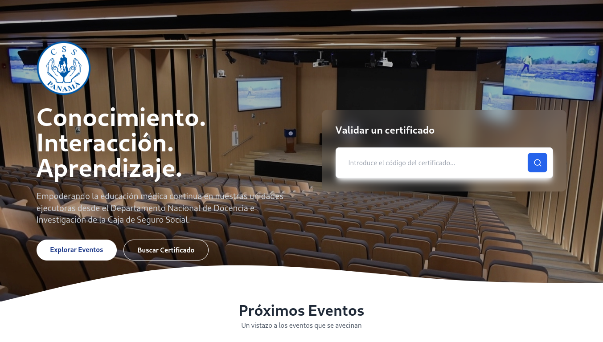

# CertiCSS

¡Hola! 👋 Este proyecto es una aplicación web diseñada específicamente para el Departamento Nacional de Docencia e Investigación de la Caja de Seguro Social en Panamá. Su objetivo es facilitar la gestión de eventos académicos, permitiendo registrar participantes, ponentes, crear eventos y subir imágenes asociadas a cada uno. Está construida con Flask y MongoDB, y es súper fácil de usar. 😊



## ¿Qué se puede hacer con CertiCSS?

- **Crear Eventos**: Define eventos con detalles como nombre, tipo, fechas, etc.
- **Registrar Participantes**: Los usuarios pueden inscribirse en eventos específicos.
- **Registrar Ponentes**: Los coordinadores locales de docencia pueden agregar ponentes con el título de su ponencia.
- **Evitar Duplicados**: La aplicación evita que los participantes se registren múltiples veces en el mismo evento y genera códigos únicos para verificar certificados.

## ¿Qué tecnologías usa?

- **Flask**: Un framework ligero y poderoso para construir aplicaciones web en Python.
- **MongoDB**: Una base de datos NoSQL que almacena toda la información de eventos, participantes y ponentes.
- **Tailwind**: Un framework CSS que hace que las interfaces se vean geniales sin complicaciones.

## ¿Cómo empezar?

### Opción 1: Instalación Local (para desarrollo)

Si quieres probar la aplicación en tu máquina, sigue estos pasos:

1. **Clona este repositorio**:
```
git clone https://github.com/linkmoises/CertiCSS.git
cd CertiCSS
```

2. **Crea un entorno virtual** (opcional pero recomendado):
```
python -m venv venv
source venv/bin/activate
```

3. **Instala las dependencias**:
```
pip install -r requirements.txt
```

4. Asegúrate de tener MongoDB instalado y en ejecución.

Si no lo tienes, puedes instalarlo siguiendo [estas instrucciones](https://www.mongodb.com/docs/manual/installation/).

5. **Crear el usuario administrador**:
```
python install.py
```

6. **Ejecuta la aplicación**:
```
python app.py
```

7. **¡Listo!** Abre tu navegador y ve a `http://localhost:5000` para empezar a usar CertiCSS.

### Opción 2: Usar Docker (para producción o pruebas rápidas)

Si prefieres no instalar nada en tu máquina o quieres probar la aplicación en un entorno aislado, ¡Docker es tu mejor amigo! 🐳

1. **Clona el repositorio** (si no lo has hecho):
```
git clone https://github.com/linkmoises/CertiCSS.git
cd CertiCSS
```

2. **Crea un archivo `.env`**:

- Copia el archivo `.env.example` y renómbralo a `.env`.
- Edita el archivo `.env` para configurar las variables de entorno necesarias (como la SECRET_KEY).

3. **Levanta los contenedores**:

Ejecuta el siguiente comando para construir y levantar la aplicación con Docker:
```
docker-compose up --build
```

4. **¡Eso es todo!** La aplicación estará disponible en `http://localhost:5000`, y MongoDB estará corriendo en segundo plano.

## ¿Quieres contribuir? ¡Genial! 🚀

Si te gusta este proyecto y quieres aportar, ¡estás más que bienvenido! Así es como puedes hacerlo:

1. Haz un fork del repositorio.
2. Crea una nueva rama (`git checkout -b feature/nueva-caracteristica`).
3. Realiza tus cambios y haz commit (`git commit -m 'Añadir nueva característica'`).
4. Haz push a la rama (`git push origin feature/nueva-caracteristica`).
5. Abre un Pull Request y cuéntame qué has hecho. ¡Estare encantado de revisarlo!

## Licencia

Este proyecto está bajo la Licencia AGPL v3. Eso significa que puedes usarlo, modificarlo y distribuirlo libremente, pero si haces cambios, debes compartirlos con la comunidad. ¡Compartir es vivir! 😄

Consulta el archivo [LICENSE](LICENSE) para más detalles.

## ¿Tienes preguntas o sugerencias?

Puedes contactarme en [moserrano@css.gob.pa] o abrir un issue en el repositorio. ¡Estoy aquí para ayudar! 🙌

**¡Gracias por usar CertiCSS!** Espero que te sea útil y que disfrutes gestionando tus eventos académicos. 💪